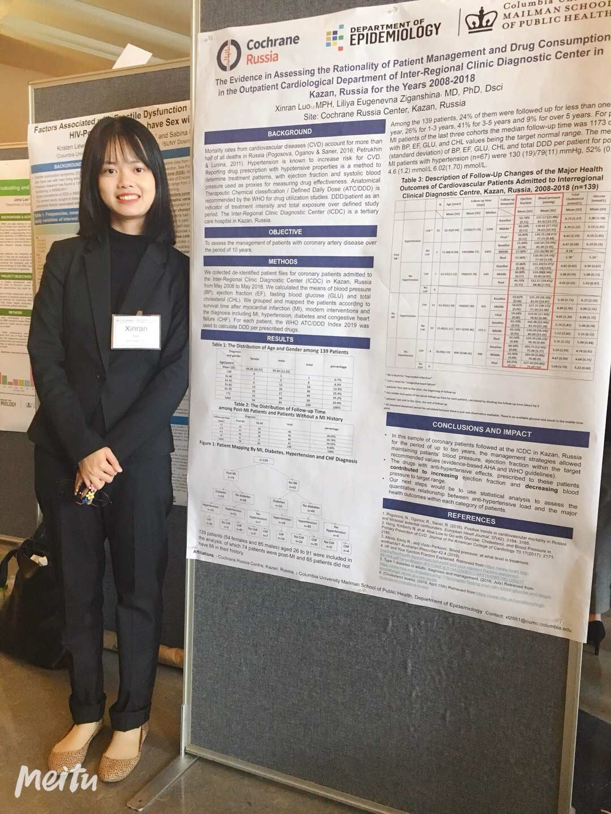

# Introduction

My name is Xinran Luo. I am an MPH student focusing on epidemiology and applied biostatistics. I am currently do a project to assess the effect of parental depression on the age of onset of depression of the offspring using survival analysis and cox model. I also took courses like categorical data analysis, linear regression and also programming classes like SAS, R, access and SQL learning to clean the data and make charts and graphs. During the summer, I did my practicum in Cochrane Russia and used Excel to assess the effectiveness of clinical management and drug consumption on patients in the cardiological department in a hospital. 
